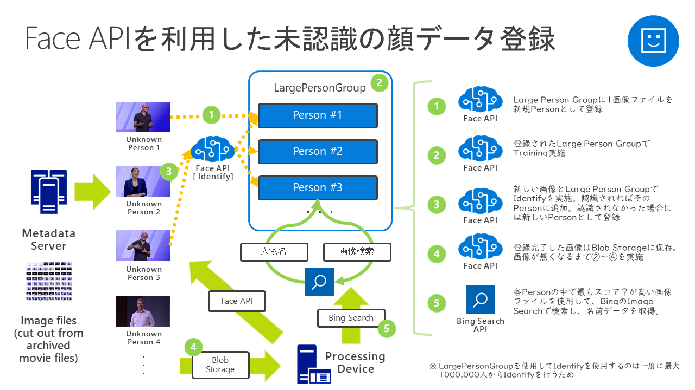

# autoFaceRegiter

## 概要
autoFaceRegisterはBashの実行環境とjqがあれば実行可能な、Azure Cognitive Services Face APIを使用した画像から自動的に人物の顔を収集するシステムです。特徴は以下の通りです。

- bashとjq、あとはAzureのサブスクリプションとインターネット環境があれば動く簡単な仕組み
- Face APIのみで動作しているので低コスト
- 取り込みごとに自動的に学習して再取り込みを行うので、取りこぼしが少ない
- 最大で100万人まで人物を登録可能（1人物247枚まで写真登録が可能です）

bashとなっておりますがGit bashで動かしているので、完全Linux環境の場合はCRLF問題などあるかもしれません。

## 仕組み
シェルの中身を見てもらえば一撃ですが、

1. 画像ディレクトリから画像ファイル一覧を作成する
2. 画像をFace APIに投げ、Detection実施
3. Face IDを受け取る
4. 3.で複数の顔を検出した場合、顔毎に矩形情報を取得
5. 既存で登録されている人物（Large Person Group内のPerson）で似たものがいないか確認
6. いなかった場合には新規人物を作成
7. 登録済みまたは新規登録の人物に顔情報を登録（複数ある場合には複数登録）
8. ログに取り込み内容を記載
9. 2～8までファイル画像が無くなるまで繰り返す

## 使い方

1. jqを実行する場所に配置
2. まずはset_envファイルに自分が使用しているFace APIのエンドポイントの場所（例えばuswest、eastasiaなど）を記入
3. 次にAPI Keyを記入
4. 画像ファイルを実行する場所かその下位にディレクトを作成して配置
5. 以下のような感じで実行

`% ./post_FaceImage.sh <画像ディレクトリ名>`

5. あとはログを見ながら完了を待つだけ

## TODO
- 登録内容を一覧出力？？
- もうちょっと早くならないか？？（無理かも）

## Notice
本プログラムは無保証です。ご利用者の責任の範囲でご利用ください。本プログラムを使用したいかなる損害につきましても補償致しません。
ライセンスは・・・とりあえずMITライセンスあたりでお願いします。